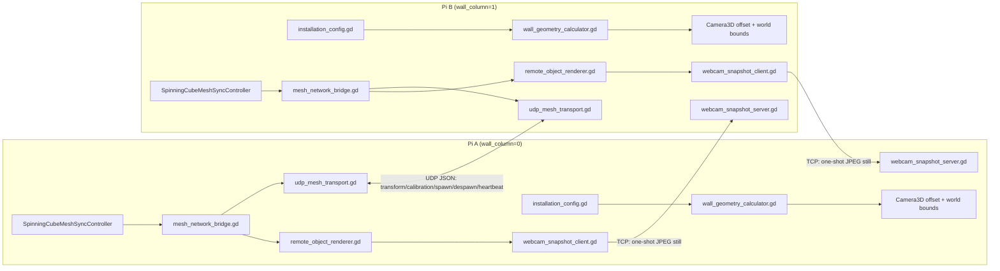

# Plan: LAN mesh networking + shared video-wall space for two (or more) Pi cubes

## Goal

Two Raspberry Pis, each driving one portrait-orientation monitor, sit side by side
(monitors almost touching, ~5-6mm bezel gap). Each Pi runs its own Godot process. The
two processes must share one virtual 3D world: each Pi's camera is offset horizontally
in that shared world to match its monitor's physical position in the wall, so a single
cube can move through the combined space and appear to travel seamlessly from one
screen to the other across the bezel gap. Each node renders its own cube
(authoritative, driven by its own webcam) plus a lightweight proxy for the other
node's cube (position/rotation only, textured with a one-time still image rather than
live video). Config (network peers, wall geometry, node identity) lives in per-Pi flat
files so nodes can be added/reconfigured without rebuilding or re-exporting the project.
The protocol must stay generic enough that future clients with different scenes can
join the same mesh and exchange the same data objects.

## Answers that shaped this plan

- **Remote cube visualization**: show a still image — the most recent webcam frame
  captured **at the moment the remote object's cube crosses into this node's visible
  region** — not continuous/live video.
- **Network topology**: must support both plain UDP broadcast (wired LAN) and targeted
  unicast to a configured peer list (needed for Wi-Fi client isolation and for
  Tailscale, which has no broadcast domain at all). Peer addresses may be hostnames
  (including Tailscale MagicDNS names), plain IPs, or a mix, selectable via config.
- **Config file location**: Godot's `user://` per-user data directory (per-Pi, not
  touched by re-exporting/redeploying the `.pck`), with the app auto-writing a
  default/template config on first run if none exists.

## Current architecture (verified in the codebase before writing this plan)

- `MeshSyncService` ([scripts/mesh_sync_service.gd](scripts/mesh_sync_service.gd)) is
  100% in-process today — it only emits Godot signals (`calibration_updated`,
  `shared_object_spawned`, `shared_object_transform_updated`, `shared_object_despawned`,
  `peer_connection_changed`). There is no network I/O anywhere in the repo yet (no
  `PacketPeerUDP`, `ENetMultiplayerPeer`, `WebSocketPeer`, `TCPServer`, or `rpc()` calls
  exist today — confirmed via full-repo grep).
- `TransformSyncSchema` ([scripts/transform_sync_schema.gd](scripts/transform_sync_schema.gd))
  already produces/consumes plain JSON-safe Dictionaries — reuse as the wire format for
  transform updates unchanged.
- `SpinningCubeMeshSyncController` ([scripts/spinning_cube_mesh_sync_controller.gd](scripts/spinning_cube_mesh_sync_controller.gd))
  owns a private `_mesh_sync_service` instance, publishes local calibration/spawn/transform
  each frame, and reacts to `calibration_updated` for **its own** `node_id` by
  repositioning the camera (`physical_position` / `physical_rotation_degrees` composed
  with `camera_offset`). This calibration → camera-placement path is exactly what's
  needed for per-node camera offsets in the wall — it just needs real computed values
  fed into it; no logic change required there.
- `SpinningCubeBoundsStrategy` ([scripts/spinning_cube_bounds_strategy.gd](scripts/spinning_cube_bounds_strategy.gd))
  has two modes: viewport-frustum 2D wrap (mode 1, camera-relative, ignores Z) and 3D
  volume wrap/clamp (mode 2, all three axes against a center/half-extents box). It
  already contains the FOV/distance/aspect frustum-width math needed for mm→world-unit
  conversion — this should be extracted and reused rather than duplicated.
- `InstallationGeometry` ([scripts/installation_geometry.gd](scripts/installation_geometry.gd))
  holds `world_bounds_center` / `world_bounds_half_extents` for the 3D volume mode.
- Camera: fixed `Camera3D` in [main.tscn](main.tscn), position `(0, 0, 4)`, FOV 65°,
  perspective projection. Cube mesh is a thin box (`Vector3(4.25, 4.25, 0.05)`).
- No existing config-file loading of any kind (no `ConfigFile`, `FileAccess.open`, JSON
  parsing) anywhere in the project before this plan.
- The shared-object descriptor schema in `MeshSyncService._normalize_descriptor`
  already anticipates this exact use case: default `capabilities` includes
  `"static_image"` and `"texture"` alongside `"shape"`, `"text"`, `"audio"`.

## Target architecture



## Implementation phases

### Phase 1 — Config system (foundation, no dependencies)

1. New `scripts/installation_config.gd` (RefCounted helper, no autoload needed):
   - Loads `user://installation.cfg` via Godot's `ConfigFile`.
   - Resolves and logs the real OS path at startup via
     `ProjectSettings.globalize_path("user://installation.cfg")` so it's easy to find on
     a headless Pi.
   - If the file doesn't exist, writes a template (see section layout below) and then
     loads it, so first run always produces an editable file with sane defaults/placeholders.
   - Exposes typed getters: `get_node_id() -> String`, `get_peer_id() -> String`,
     `get_wall_layout() -> Dictionary`, `get_network_settings() -> Dictionary`,
     `get_peers() -> Dictionary`, `get_camera_settings() -> Dictionary`.
   - Config sections:
     - `[node]`: `node_id`, `peer_id`.
     - `[wall]`: `columns`, `rows`, `monitor_width_mm`, `monitor_height_mm`, `gap_mm`,
       `this_node_column`, `this_node_row` (0-based).
     - `[network]`: `mode` (`broadcast` | `unicast` | `both`), `udp_port`,
       `broadcast_address` (default `255.255.255.255`), `snapshot_tcp_port`,
       `heartbeat_interval_sec`, `peer_timeout_sec`.
     - `[peers]`: free-form `peer_id = host_or_ip[:port]` entries — host may be a plain
       IP, a LAN hostname, or a Tailscale MagicDNS name.
     - `[camera]`: mirrors the existing exported webcam/CSI settings from
       [spinning_cube.gd](spinning_cube.gd) (feed index, CSI width/height/fps/name,
       fit mode, flip) so those become per-Pi editable without rebuilding.
2. New `config/installation.template.cfg` bundled under `res://` — canonical source
   text for the template that gets copied to `user://` on first run, and doubles as
   in-repo documentation of the config format.
3. [spinning_cube.gd](spinning_cube.gd) `_ready()`: load `InstallationConfig` before
   `_configure_components()` runs; config values override the exported var defaults
   for `mesh_node_id`, `mesh_peer_id`, and webcam settings. Exported vars remain as
   editor-time fallback defaults when a config value is absent.

### Phase 2 — Wall geometry & per-node camera calibration (*depends on Phase 1*)

4. New `scripts/wall_geometry_calculator.gd` (pure functions, no state):
   - `frustum_size_at_distance(camera: Camera3D, distance: float) -> Vector2` — the
     frustum half-width/height-from-FOV math currently inline in
     `spinning_cube_bounds_strategy.gd`, extracted here so both bounds-wrapping and
     camera-offset math share one implementation (avoids the two drifting apart).
   - `compute_world_units_per_mm(camera: Camera3D, monitor_width_mm: float) -> float` —
     one monitor's on-screen width in world units (from the frustum calc at the cube's
     depth) divided by its physical width in mm.
   - `compute_node_camera_offset(wall_layout: Dictionary, world_units_per_mm: float) -> Vector3` —
     this node's horizontal (and, for future multi-row walls, vertical) world-space
     offset from the wall's center, derived from `this_node_column`/`this_node_row`,
     `monitor_width_mm`/`monitor_height_mm`, and `gap_mm`.
   - `compute_wall_world_bounds(wall_layout: Dictionary, world_units_per_mm: float) -> Dictionary` —
     returns `{center: Vector3, half_extents: Vector3}` for the *entire* wall (all
     columns/rows combined), for feeding into `InstallationGeometry`/bounds strategy.
5. [spinning_cube.gd](spinning_cube.gd): after loading config, compute the camera
   offset and wall bounds, then:
   - Force `bounds_mode = BOUNDS_3D_VOLUME` and `bounds_behavior = WRAP` (the old
     per-viewport 2D wrap mode no longer makes sense once the world spans multiple
     screens), setting `bounds_volume_center` / `bounds_volume_half_extents` (or
     `installation_geometry`) from the computed wall bounds.
   - Set `calibration_model.physical_position` (rotation stays zero for a flat
     side-by-side wall, but is supported for future angled installs) to the computed
     per-node camera offset **before** calling `mesh_sync_controller.configure(...)`,
     so the existing `_on_calibration_updated` camera-placement code applies it
     immediately with no changes to that method.

### Phase 3 — UDP mesh transport with broadcast + unicast/hostname support (*parallel with Phase 2, depends on Phase 1*)

6. New `scripts/peer_address_book.gd`:
   - Parses the `[peers]` config section into `{peer_id: {host: String, port: int}}`.
   - Resolves hostnames (including Tailscale names) via `IP.resolve_hostname()` lazily
     and caches results; if resolution fails (e.g. Tailscale daemon not up yet at
     boot), logs and retries on a timer rather than failing hard.
7. New `scripts/udp_mesh_transport.gd` (Node, needs per-frame polling):
   - Binds one `PacketPeerUDP` for receiving on `network.udp_port` and enables
     broadcast sending when `network.mode` includes broadcast.
   - `send(message: Dictionary)`: JSON-encodes once via `JSON.stringify`, then per
     configured mode sends to `broadcast_address:udp_port` and/or to every resolved
     peer in the address book (always skip sending to self).
   - Poll loop (in `_process`): while `get_available_packet_count() > 0`, read the
     packet, `JSON.parse_string` it, validate `type` and schema version, and emit a
     `message_received(dict)` signal. Malformed/unparseable packets are logged and
     dropped — never allowed to crash the receiver.
   - Message envelope (stable, documented contract — see Phase 6):
     ```json
     {
       "type": "transform" | "calibration" | "spawn" | "despawn" | "heartbeat",
       "sender_peer_id": "pi-north",
       "payload": { /* TransformSyncSchema dict, MeshCalibrationModel.to_dictionary(), or descriptor dict, as appropriate */ }
     }
     ```
8. New `scripts/mesh_network_bridge.gd` (Node) — glue between the transport and
   `MeshSyncService`:
   - Add a small `get_mesh_sync_service()` getter to
     `SpinningCubeMeshSyncController` (the only change needed there for this phase) so
     the bridge and `RemoteObjectRenderer` can attach to the same service instance.
   - **Outbound**: explicit calls added at the existing local-publish call sites in
     `spinning_cube_mesh_sync_controller.gd` (`_publish_calibration`,
     `_publish_object_descriptor`, `process_transform`) also hand the payload to the
     bridge for sending. This avoids any ambiguous "was this signal local or remote"
     detection — outbound sends are driven explicitly by code that already knows the
     update originated locally.
   - **Inbound**: on `message_received`, the bridge sets an `_applying_remote = true`
     guard, calls the matching `_mesh_sync_service.publish_*` method (GDScript signal
     emission is synchronous, so the guard is race-free within one call), then clears
     the guard. The bridge never re-sends while the guard is set, so remote-applied
     updates don't get echoed back onto the network.
   - **Heartbeat / presence**: a timer sends a `heartbeat` message every
     `network.heartbeat_interval_sec`; the bridge tracks last-seen time per `peer_id`
     (updated by any inbound message, not just heartbeats). If a peer exceeds
     `network.peer_timeout_sec` with no traffic, the bridge calls
     `_mesh_sync_service.set_peer_online(peer_id, false)` (existing signal, already
     wired) so `RemoteObjectRenderer` (Phase 4) can despawn its stale proxy.

### Phase 4 — Render remote peers' cubes as proxies (*depends on Phase 2 & 3*)

9. New `scripts/remote_object_renderer.gd` (Node, deliberately generic/not
   `SpinningCube`-specific, so future differently-scened clients can reuse it):
   - Listens to the shared `MeshSyncService` signals: `shared_object_spawned`,
     `shared_object_transform_updated`, `shared_object_despawned`,
     `peer_connection_changed`.
   - Ignores any `object_id` matching this node's own `shared_object_id` (that's the
     local authoritative cube, already fully handled by
     `SpinningCubeMeshSyncController`).
   - On spawn of a foreign `object_id`: instantiates a lightweight proxy
     `MeshInstance3D` (reusing `BoxMesh` + a duplicated `ShaderMaterial`, sized per
     `descriptor.render_config` where available, else sane defaults) and adds it as a
     scene-tree sibling.
   - On transform update for a foreign `object_id` (already filtered to skip
     self-owned updates via the existing `owner_peer_id` check pattern used in
     `_on_shared_object_transform_updated`): sets the proxy's `global_transform`
     directly from the networked position/rotation.
   - On despawn, or on `peer_connection_changed(peer_id, false)` for the owning peer:
     frees the proxy node.
   - **Visibility-crossing detection**: each frame, reuses
     `WallGeometryCalculator.frustum_size_at_distance` to test whether the proxy's
     world position has just entered this node's local camera frustum region (a rising
     edge from "outside" to "inside", tracked per-object-id). On that rising edge,
     triggers the Phase 5 snapshot fetch — and only then, not continuously.

### Phase 5 — One-shot webcam still via TCP, fetched on visibility-crossing (*depends on Phase 4*)

10. New `scripts/webcam_snapshot_server.gd` (Node): a `TCPServer` listening on
    `network.snapshot_tcp_port`, polled non-blockingly each `_process` via
    `server.poll()` / `server.take_connection()`. On an accepted connection, reads a
    trivial one-line request, grabs the current webcam `Image` (add a small
    `get_current_frame_image() -> Image` accessor to
    [scripts/camera_source_adapter.gd](scripts/camera_source_adapter.gd) and
    [scripts/webcam_camera_source_adapter.gd](scripts/webcam_camera_source_adapter.gd)),
    encodes it via `Image.save_jpg_to_buffer(quality)`, writes a 4-byte length prefix
    plus the JPEG bytes, then closes the connection.
11. New `scripts/webcam_snapshot_client.gd`: given a `peer_id`, looks up its address
    via `PeerAddressBook`, opens a `StreamPeerTCP`, and polls the connection across
    frames as a small non-blocking state machine (`connecting` → send request → read
    length prefix → read body → `done`/`error`). Decodes via
    `Image.load_jpg_from_buffer`, returns an `ImageTexture`. Fire-and-forget with a
    short timeout; failures are logged and simply skip the still (the proxy keeps its
    previous texture, or a neutral fallback color/material if it never got one).
12. `RemoteObjectRenderer` (Phase 4) calls `WebcamSnapshotClient` on the
    visibility-crossing rising edge, and on completion sets the proxy's shader
    `webcam_texture` uniform with `webcam_mode` set to the static-image path (matching
    the `"static_image"` capability already declared in the descriptor schema) — no
    continuous/live updates after that.

### Phase 6 — Multi-client friendliness & polish (*depends on all above*)

13. Document the UDP JSON envelope and TCP snapshot protocol as a stable contract in
    code comments on `udp_mesh_transport.gd` / `webcam_snapshot_server.gd` (not a new
    markdown file), so a different scene/client can spawn its own `shared_object_id`,
    publish transforms, and interoperate without depending on any `SpinningCube`-specific
    code.
14. Ensure unknown `descriptor.kind` values are handled gracefully by
    `RemoteObjectRenderer` (fallback to a generic box proxy) rather than crashing,
    since other future client types may introduce new kinds.
15. Update [README.md](README.md) with the new `user://installation.cfg` fields,
    default ports, and the hard requirement that wall geometry
    (`columns`/`rows`/`monitor_width_mm`/`monitor_height_mm`/`gap_mm`) must match
    across all nodes in the same installation.

## Relevant files

- `scripts/installation_config.gd` — new: config load/template/write.
- `config/installation.template.cfg` — new: bundled template text.
- `scripts/wall_geometry_calculator.gd` — new: shared frustum/mm math (also refactor
  [scripts/spinning_cube_bounds_strategy.gd](scripts/spinning_cube_bounds_strategy.gd)
  to call into it instead of duplicating the frustum math).
- `scripts/peer_address_book.gd` — new: hostname/IP/Tailscale resolution + caching.
- `scripts/udp_mesh_transport.gd` — new: `PacketPeerUDP` broadcast+unicast send/receive.
- `scripts/mesh_network_bridge.gd` — new: wires transport ⇄ `MeshSyncService` with a
  reentrancy guard against network echo loops.
- `scripts/remote_object_renderer.gd` — new: spawns/updates/despawns proxy cubes,
  visibility-crossing detection.
- `scripts/webcam_snapshot_server.gd` — new: TCP still-image server.
- `scripts/webcam_snapshot_client.gd` — new: TCP still-image fetch client.
- [scripts/spinning_cube_mesh_sync_controller.gd](scripts/spinning_cube_mesh_sync_controller.gd) —
  add `get_mesh_sync_service()` getter; call bridge send at existing
  `_publish_calibration` / `_publish_object_descriptor` / `process_transform` sites.
- [scripts/spinning_cube_bounds_strategy.gd](scripts/spinning_cube_bounds_strategy.gd) —
  refactor frustum math into `wall_geometry_calculator.gd`; confirm the
  `BOUNDS_3D_VOLUME` path is what's used for the wall scenario.
- [scripts/camera_source_adapter.gd](scripts/camera_source_adapter.gd) /
  [scripts/webcam_camera_source_adapter.gd](scripts/webcam_camera_source_adapter.gd) —
  add `get_current_frame_image() -> Image` accessor for the snapshot server.
- [spinning_cube.gd](spinning_cube.gd) — load config at startup, compute wall
  bounds/camera offset, instantiate `MeshNetworkBridge`, `RemoteObjectRenderer`,
  `WebcamSnapshotServer`.
- [README.md](README.md) — document config file, ports, and the cross-node wall
  geometry matching requirement.

## Verification

1. Two-instance local smoke test (e.g. two processes on the same Mac with distinct
   `--user-data-dir` overrides so each gets its own `user://installation.cfg`):
   distinct `node_id`/`wall_column` per instance, confirm UDP packets are exchanged
   (log received message counts) and each shows a proxy cube for the other's
   `object_id` at the geometrically correct offset.
2. Manual two-Pi test on real hardware: verify the cube visually "continues" across
   the bezel gap without a position jump/overlap when crossing from monitor A to
   monitor B.
3. Wi-Fi/Tailscale test: temporarily disable broadcast in config
   (`network.mode = unicast`), rely on the `[peers]` unicast list with a Tailscale
   hostname, confirm transform sync and snapshot fetch still work.
4. Kill one Pi's process; confirm the other despawns its proxy after
   `peer_timeout_sec` via `peer_connection_changed`.
5. Confirm still-image fetch only happens once per visibility-crossing (log fetch
   count), not continuously, and that a failed fetch (server down) doesn't crash or
   spam retries.

## Key decisions

- Remote cubes show a one-time still fetched over TCP on visibility-crossing, not
  live video — keeps bandwidth trivial and avoids building a video-streaming subsystem.
- Network supports both broadcast and configured-peer unicast, selected via
  `[network] mode` in config; peer addresses may be hostnames (Tailscale-friendly).
- Config lives in `user://` with an auto-written template on first run, and the
  resolved OS path is logged so it's easy to find on a headless Pi.
- Bounds mode switches from per-viewport 2D wrap to a single shared 3D volume spanning
  the whole wall — required for the cube to travel across both monitors as one space.
- Loop-prevention for the network bridge uses an explicit outbound call-site plus an
  inbound reentrancy guard, not signal-origin tagging — simpler, and avoids touching
  `MeshSyncService`'s existing signal contract.

## Recommendations from the Phase 1/2 tuning work

- Keep the wall geometry math and the runtime camera calibration separated from the
  network bridge. The wall math should remain a pure geometry utility, while the
  bridge only transports already-normalized sync payloads.
- Do not make the network stack responsible for scene-specific behavior. It should
  exchange generic mesh snapshots and transforms, and leave visibility / rendering /
  material decisions to the local scene logic.
- Treat the camera distance and world depth as configuration values, not hard-coded
  assumptions. The demo scene should be able to move farther from the camera or use a
  deeper wall volume without forcing a code change.
- Keep the per-node physical offset in `calibration_model.physical_position` and leave
  the rest of the camera placement logic alone. That is the correct integration point
  for the wall-aligned calibration we want across nodes.
- Build the network bridge to be explicitly re-entrant-safe: outbound sends should be
  triggered only from known local publish call sites, while inbound payloads should use
  a short guard to avoid echo loops.
- Prefer a single shared 3D wall volume to the old viewport-wrap model for any multi-
  monitor installation. The former preserves the continuity of motion across monitor
  boundaries, which is the actual installation behavior we care about.
- Keep the visual tuning knobs in the scene or config (camera z-distance, motion speed,
  wall depth) separate from the transport contract. That way the networking can stay
  stable even while the display and motion feel are tuned.
- For the actual wall install, validate the cube motion with a real two-monitor test and
  keep the per-node `this_node_column` values consistent with the shared wall geometry.
  If the wall geometry differs between nodes, the motion will appear to jump or
  overlap even if the networking is working perfectly.
</content>
